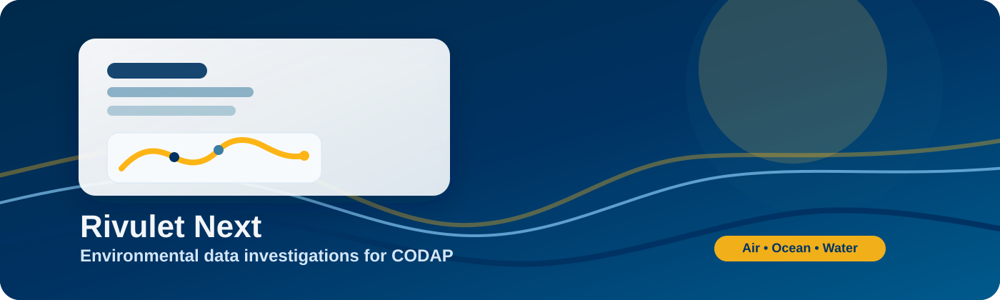

# Rivulet Next

Rivulet Next is an experimental collection of CODAP plugins for exploring environmental data through guided investigations. Each plugin connects to public data sources and helps learners reason about mechanisms behind air quality, sea level, and water quality patterns.

> ⚠️ These plugins are still experimental, are liable to break or time out, and are best used in a fresh CODAP document.

## What you can explore

- Air quality data from the EPA Air Quality System (AQS)
- Sea level and ocean temperature patterns from NOAA CoastWatch
- Water quality indicators from USGS Water Quality Exchange (WQX)

## Load a plugin into CODAP

Drag one of the plugin links below into a fresh CODAP document to load it:

- [AQS Air Quality Explorer](https://michellehoda.github.io/rivulet-next/aqs-plugin/index.html) — Investigate pollutants, AQI, and nearby monitors.
- [CoastWatch Ocean Explorer](https://michellehoda.github.io/rivulet-next/coastwatch-plugin/index.html) — Compare sea level signals and thermal expansion.
- [WQX Water Quality Explorer](https://michellehoda.github.io/rivulet-next/wqx-plugin/index.html) — Explore salinity, E. coli, oxygen, nitrates, and lead. (But actually maybe not all of them... like I said, it's experimental.)

## Quick start

1. Open a fresh CODAP document.
2. Drag your chosen plugin link onto the CODAP screen.
3. Follow the tabs in the plugin to set up and run the investigation.

## Project notes

- The plugins are designed to support mechanism-focused environmental data investigations.
- They are intentionally experimental and may evolve over time as the project develops.
- This work is based on materials developed with the support of the National Science Foundation (Award #2445609). See [Rivulet](https://github.com/calcore/rivulet-utils) for more information.

## Is this README...?

Yes, it's mostly AI-generated. I used oil's [beautify-github-readme](https://github.com/oil-oil/beautify-github-readme) and it did a pretty good job with it!